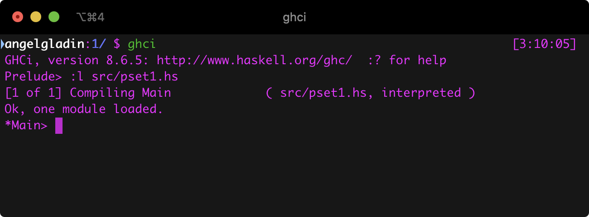
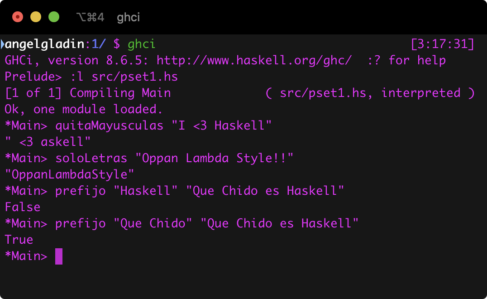
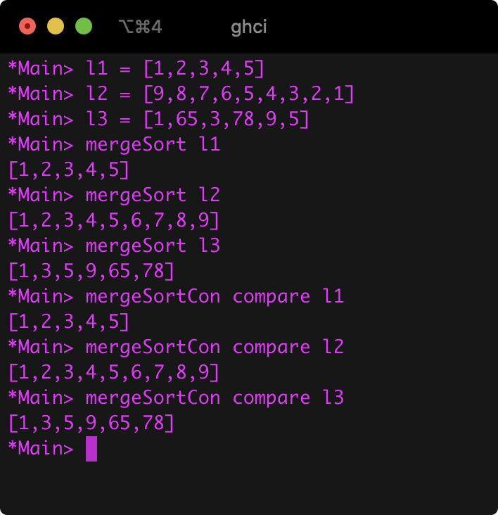
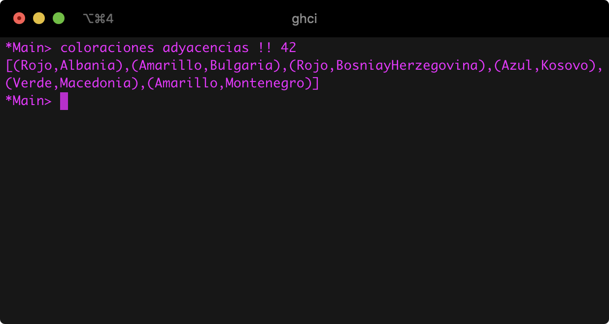
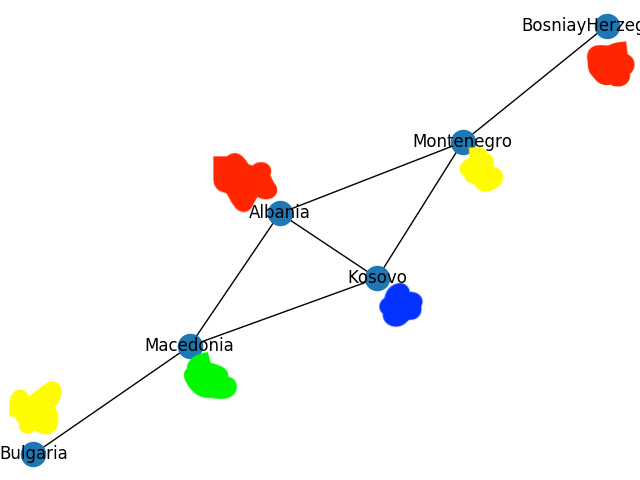
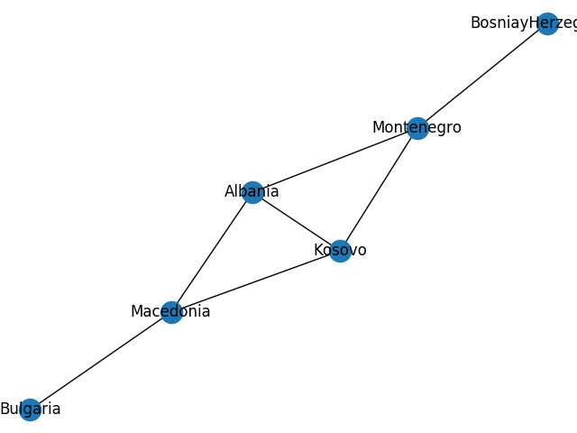

# Tarea 1: Haaave you met Haskell?

## Información del curso

Programación Declarativa - Facultad de Ciencias, UNAM.

* Profesor: Favio E. Miranda Perea
* Ayudante	Javier Enríquez Mendoza

## Descripción de la práctica

En el archivo de especificación de la prática viene todo explicado 
`doc.pdf`.

## Entorno

* `ghci`: The Glorious Glasgow Haskell Compilation System, version 8.6.5

## Ejecución

Estando ubicado con la términal en el directorio de la práctica,
ejecutar `ghci` y después `:l src/pset1.hs` como se muestra enseguida.



### Strings



### Merge Sort



### Coloración

Para la función `esBuena` primero hice la función `coloraciones` para generar 
todas las posibles buenas coloraciones.

Para ello lo primero que se hará es obtener una coloración arbitraria de `coloraciones`, 
por ejemplo tomemos la coloración indexada de esa lista número 42.



Podemos verificar que en efecto es una coloración válida.



Por cierto, me salieron 432 coloraciones válidas con las configuraciones que 
se nos dieron.

## Comentarios

Con la biblioteca de `networkx` y `matplotlib` en Python hice dibujé la gráfica para 
apoyarme visualmente para ver como se veía la gráfica y en checar rápidamente 
las coloraciones que obtuve, para eso hice el siguiente script.

```python
import networkx as nx
import matplotlib.pyplot as plt

g = nx.Graph()

edges = [('Albania', 'Montenegro'), ('Albania', 'Kosovo'), ('Albania', 'Macedonia'),
         ('Bulgaria', 'Macedonia'), ('BosniayHerzegovina', 'Montenegro'),
         ('Kosovo', 'Macedonia'), ('Kosovo', 'Montenegro')]

for (a, b,) in edges:
    g.add_edge(a, b)

nx.draw(g, with_labels=True)
plt.savefig("graph.png")

```

Dando como resultado la siguiente imagen.



En la parte de `#coloraciones` en `src/pset1.hs` de la línea 101 a 113 quise hacerlo 
más dinámico pero ya me quería dormir e hice restringido los colores y las ciudades.

## Referencias

* https://hackage.haskell.org/package/base-4.12.0.0/docs/Data-Char.html
* http://zvon.org/other/haskell/Outputprelude/filter_f.html
* https://www.hackerearth.com/practice/algorithms/sorting/merge-sort/tutorial/
* http://zvon.org/other/haskell/Outputsyntax/caseQexpressions_reference.html
* https://hackage.haskell.org/package/base-4.12.0.0/docs/src/Data.List.NonEmpty.html#splitAt
* https://hackage.haskell.org/package/base-4.12.0.0/docs/src/GHC.List.html#lookup
* https://en.wikipedia.org/wiki/Cartesian_product

## Integrante(s)

* Ángel Iván Gladín García - *angelgladin@ciencias.unam.mx*

