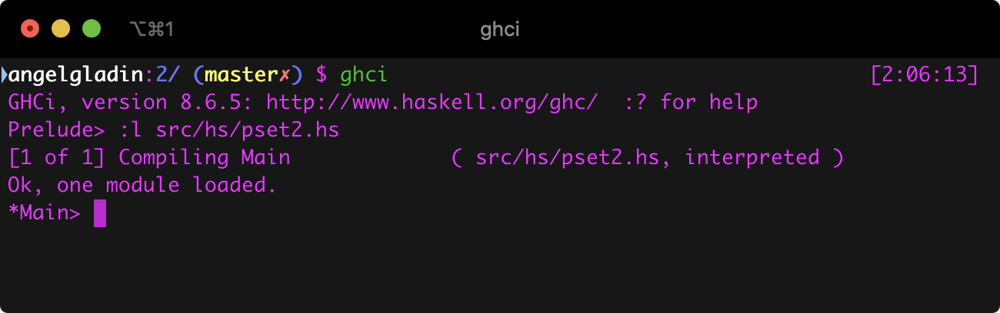
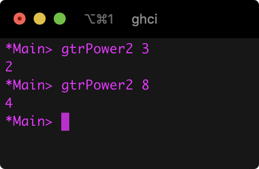
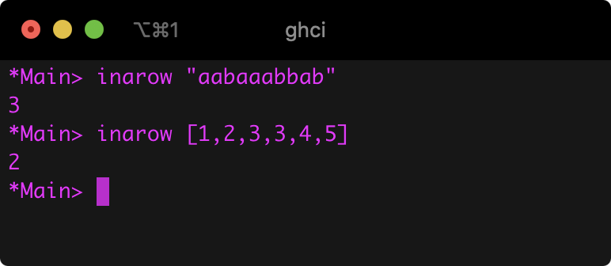
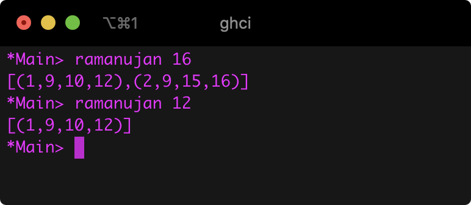

# Tarea 2: The Imperative is Dark and Full of Terrors

## Información del curso

Programación Declarativa - Facultad de Ciencias, UNAM.

* Profesor: Favio E. Miranda Perea
* Ayudante	Javier Enríquez Mendoza

## Descripción de la práctica

En el archivo de especificación de la prática viene todo explicado 
`doc.pdf`.

## Entorno

* `ghci`: The Glorious Glasgow Haskell Compilation System, version 8.6.5
* `latexmk`: Latexmk, John Collins, 17 Jan. 2018. Version 4.55

## Ejecución

Estando ubicado con la términal en el directorio de la práctica,
ejecutar `ghci` y después `:l src/hs/pset2.hs` como se muestra enseguida,

### `gtrPower2`

### `inarow`

### `ramanujan`

Aquí hice unas pequeñas observaciones al momento de implementar la función, 
quité simetrías, una tupla de la lista solo tiene elementos
**distintos** y los el contenido de cada tuple está en orden creciente.

### Parte teórica

Se encuentra en la raíz del proyecto con el nombre de `parte-teorica.pdf`.

## Referencias

* https://hackage.haskell.org/package/base-4.12.0.0/docs/src/GHC.List.html#takeWhile
* https://www.inf.ed.ac.uk/teaching/courses/inf1/fp/reading/walker-proofs.pdf
* Thinking Functionally with Haskell 1st Edition by Richard Bird.
* https://www.cs.dartmouth.edu/~doug/cs118/map.compose.html
* http://bingweb.binghamton.edu/~head/CS471/NOTES/HASKELL/6hSpr01.html
* https://stackoverflow.com/questions/940382/what-is-the-difference-between-dot-and-dollar-sign/13700768#13700768
  
## Integrante(s)

* Ángel Iván Gladín García - *angelgladin@ciencias.unam.mx*

