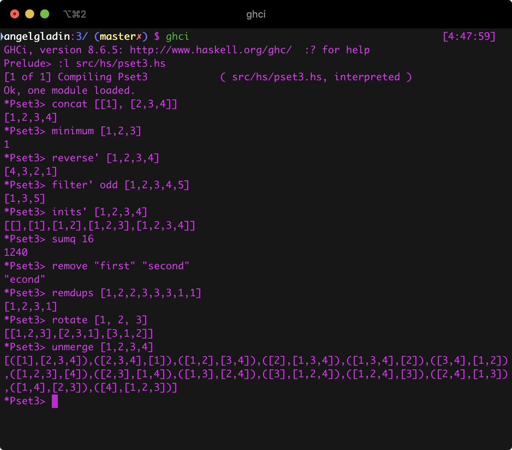

# Tarea 3: Bringing you into the fold

## Información del curso

Programación Declarativa - Facultad de Ciencias, UNAM.

* Profesor: Favio E. Miranda Perea
* Ayudante:	Javier Enríquez Mendoza

## Descripción de la práctica

En el archivo de especificación de la prática viene todo explicado 
`doc.pdf`.

## Entorno

* `ghci`: The Glorious Glasgow Haskell Compilation System, version 8.6.5
* `latexmk`: Latexmk, John Collins, 17 Jan. 2018. Version 4.55
* `hindent`: hindent 5.3.1

## Ejecución

Estando ubicado con la términal en el directorio de la práctica,
ejecutar `ghci` y después `:l src/hs/pset3.hs` como se muestra enseguida,

### Parte teórica

Se encuentra en la raíz del proyecto con el nombre de `parte-teorica.pdf`.

## Referencias

* Hutton, Graham. (1999). A Tutorial on the Universality and Expressiveness of Fold. Journal of Functional Programming. 9. 10.1017/S0956796899003500.
* Bird, Richard S.. “Thinking Functionally with Haskell.” (2014).
* Richard Bird. 2010. Pearls of Functional Algorithm Design (1st. ed.). Cambridge University Press, USA.
* https://hackage.haskell.org/package/base-4.12.0.0/docs/Data-List.html#v:inits
* https://www.haskell.org/onlinereport/haskell2010/haskellch5.html

## Integrante(s)

* Ángel Iván Gladín García - *angelgladin@ciencias.unam.mx*
